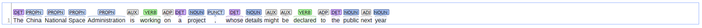
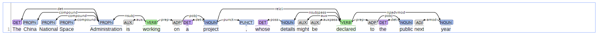

# spacybrat
Html visualization for the spacy dependency parsing using brat

## Introduction
This repository contains a simple python script to visualize the dependency parsing of a spacy document using brat.
Is supports the the visualization of: pos, dependency and named entities.

You can directly import these html content to you custom web and finish the embedding.

## Usage

```python
from spacybrat import render_spacybrat

text = "The China National Space Administration is working on a project, whose details might be declared to the public next year"
pos_html = render_spacybrat(text, save_path="pos.html", object="pos", lang="en")
dep_html = render_spacybrat(text, save_path="dep.html", object="dep", lang="en")
ner_html = render_spacybrat(text, save_path="ner.html", object="ner", lang="en")
```
Then click the html file to open it in your browser, you will see the visualization of the dependency parsing respectively.
#### pos_html


#### dep_html


#### ner_html

